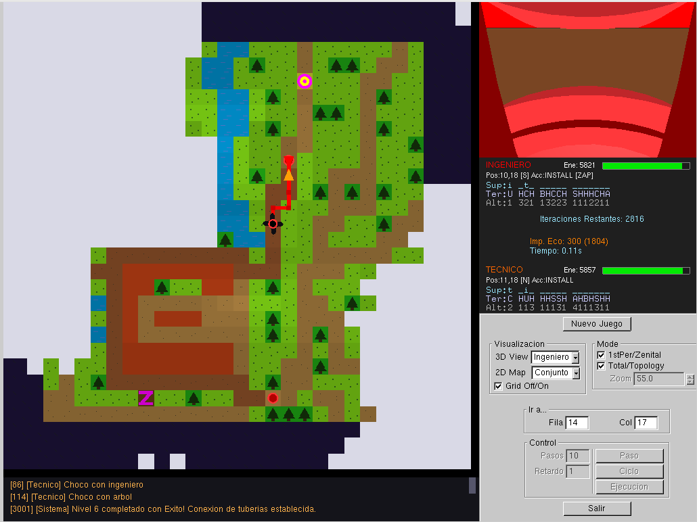
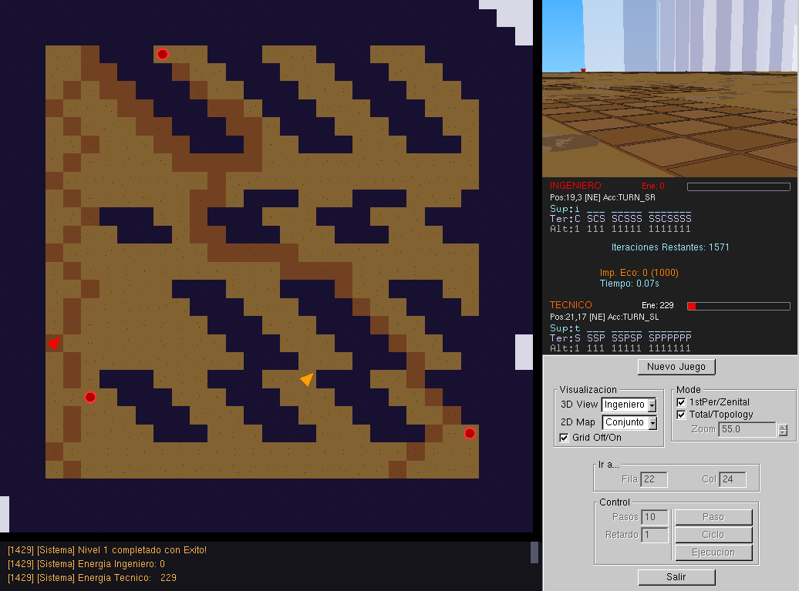
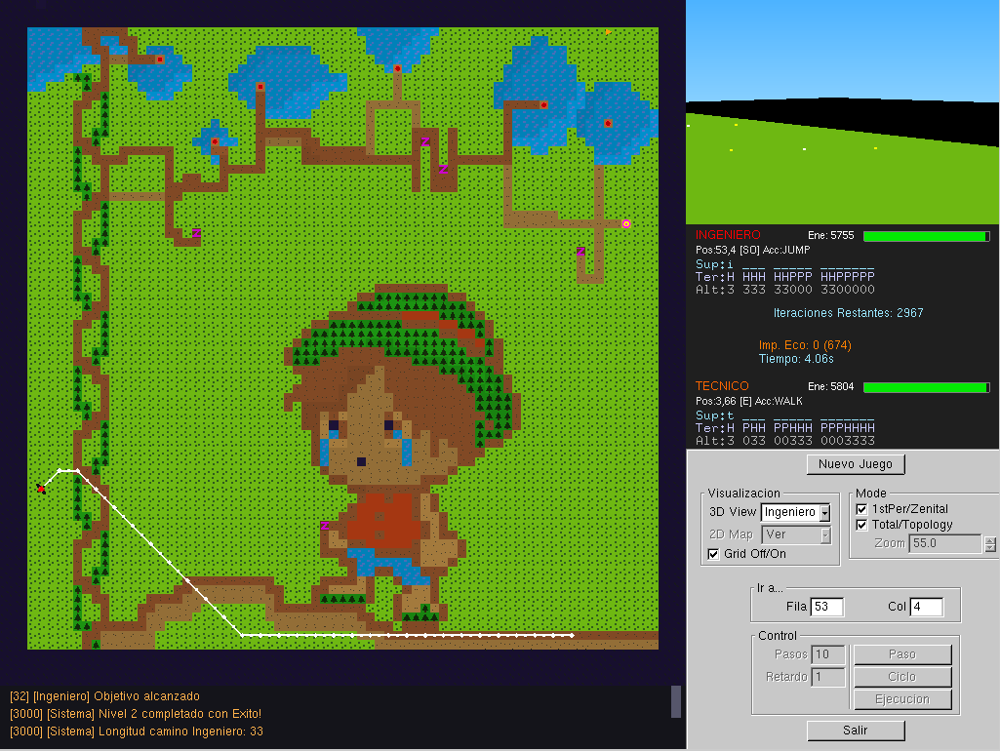
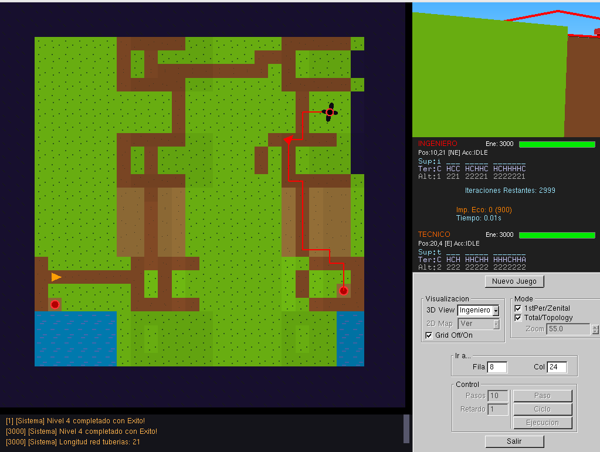
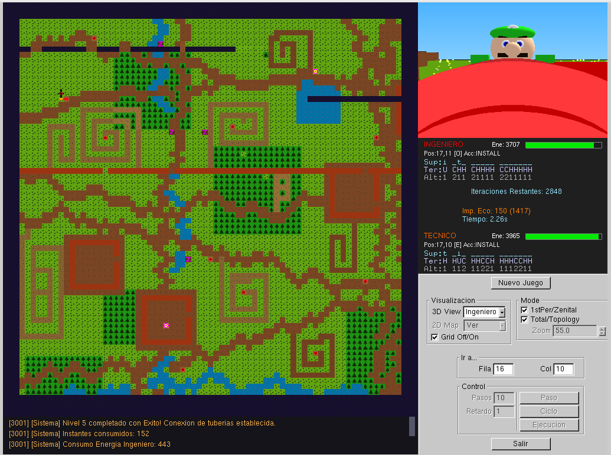

# Belkanite Containment

**Development period:** April – May 2026  
**Course:** Artificial Intelligence  
**University:** University of Granada  
**Language:** C++

Artificial Intelligence project developed in C++ focused on the design of reactive and deliberative autonomous agents.

The project follows two agents, an **Engineer** and a **Technician**, whose objective is to contain toxic Belkanite leaks by exploring the environment, planning routes and ultimately constructing a viable pipeline to a waste treatment plant.

## Final mission



The project progressively combines reactive exploration, state-space search, heuristic planning, resource constraints and multi-agent coordination.

## Overview

The environment is represented as a discrete map containing different terrain types, elevation levels, obstacles, equipment and treatment plants.

The two agents have different capabilities and must cooperate to complete increasingly complex tasks.

The **Engineer** can move, jump, modify terrain height and coordinate the construction process.

The **Technician** assists the Engineer during pipeline construction and has different movement capabilities depending on the available equipment.

Throughout the different levels, the agents evolve from simple reactive behaviours to complete deliberative planning and coordinated execution.

## Project levels

### Level 0 — Reactive navigation

Both agents operate on an initially unknown map and must independently reach different waste treatment plants.

The solution is based on reactive behaviour using the information provided by the agents' sensors.

This level introduces autonomous navigation without prior knowledge of the environment.

### Level 1 — Reactive exploration

The agents explore an initially unknown environment and progressively construct their internal representation of the world.

My exploration strategy includes:

- Selection of promising visible cells according to terrain priorities
- Preference for useful equipment when it has not yet been collected
- Tracking the number of visits to each position
- Selection of less-visited cells to encourage exploration
- Detection and breaking of repetitive movement loops
- Use of `JUMP` by the Engineer when it provides a safe exploration advantage



### Level 2 — Engineer route planning

The Engineer must reach the detected Belkanite leak while minimising the number of simulation steps.

The state representation considers:

- Position
- Orientation
- Equipment state

The search also considers the Engineer's ability to use `JUMP`, terrain accessibility, elevation differences and the effect of obtaining shoes.

An A* search strategy is used to guide the Engineer towards the destination while finding an efficient route.



### Level 3 — Energy-aware Technician planning

The Technician must reach the Belkanite leak while minimising total energy consumption.

The search is based on A*, but the accumulated cost represents **energy consumption** rather than simply the number of actions.

Movement cost depends on factors such as:

- Terrain type
- Elevation differences
- Available actions
- Equipment state

A Chebyshev-distance heuristic is used to estimate the remaining distance to the destination.

The Technician's equipment also affects accessibility: after obtaining the shoes, forest cells become traversable.


### Level 4 — Pipeline planning

The objective changes from moving an agent to planning an entire pipeline network.

The Engineer must calculate a valid pipeline connecting the Belkanite leak to a waste treatment plant.

The planner considers:

- Pipeline length
- Terrain elevation
- Excavation operations
- Terrain elevation operations
- Available energy
- Maximum ecological impact
- Valid gravity flow between consecutive pipeline sections

The pipeline state stores the current position, effective terrain height, accumulated energy consumption, ecological impact and the sequence of planned pipeline sections.

The search uses an A*-based strategy where the accumulated cost represents the number of pipeline sections and the heuristic estimates the distance to the nearest treatment plant.



### Level 5 — Multi-agent pipeline construction

In this level, the planned pipeline must actually be constructed.

The solution combines the planning mechanisms developed in the previous levels with coordinated execution between the Engineer and the Technician.

The Engineer first calculates a valid pipeline and then both agents repeatedly:

- Move towards the required construction positions
- Modify terrain when necessary
- Position themselves on consecutive pipeline cells
- Align face-to-face
- Execute `INSTALL` simultaneously
- Continue with the next pipeline section

The behaviour is organised through state machines that control the different stages of movement, alignment, terrain modification and installation.

Route-planning algorithms from previous levels are reused to move both agents between construction positions.

Reactive checks are also used to handle collisions, temporary blocking situations and unexpected interference between the two agents.



### Level 6 — Exploration, planning and execution

The final level combines the techniques developed throughout the entire project.

Unlike Level 5, the map is initially unknown.

The solution is divided into three main phases:

**Exploration**

The Engineer and Technician explore the environment using the reactive behaviour developed for Level 1 while progressively constructing the known map.

**Planning**

Once enough information has been discovered, the Engineer attempts to calculate a viable pipeline between the Belkanite leak and a treatment plant.

If no valid solution can yet be found, the agents return to exploration and gather additional information.

**Execution**

Once a valid plan exists, the agents switch to the coordinated construction behaviour developed for Level 5.

This final scenario combines reactive exploration, A* route planning, pipeline planning and multi-agent coordination in a partially observable environment.

## Artificial Intelligence techniques

### Reactive agents

The first stages of the project use sensor-driven reactive behaviour.

The agents analyse their immediate environment, prioritise useful terrain and equipment, maintain information about visited locations and detect repetitive movement patterns.

### State-space search

Navigation problems are represented through states containing the information required to distinguish different possible situations, including position, orientation and equipment.

Previously explored states are tracked to avoid unnecessary repeated exploration.

### A* search

A* is used in several parts of the project with different optimisation criteria.

For the Engineer, the search is used to find efficient routes towards a destination.

For the Technician, the accumulated cost represents energy consumption, allowing the search to prioritise routes that require less energy.

### Heuristic search

Heuristic functions guide the search towards promising states and reduce the amount of unnecessary exploration.

For Technician navigation, a Chebyshev-distance heuristic is used because movement can occur in eight orientations.

### Resource-aware planning

Some problems require considering more than distance.

The pipeline planner also keeps track of:

- Available energy
- Ecological impact
- Terrain elevation
- Terrain modifications
- Pipeline length

States that exceed the available resource limits are discarded during the search.

### Multi-agent coordination

The advanced levels require the Engineer and Technician to cooperate.

Their behaviour is controlled through state machines that coordinate movement, positioning, communication and simultaneous pipeline installation.

### Hybrid reactive-deliberative behaviour

The final stages combine deliberative planning with reactive mechanisms.

Plans determine the general strategy, while reactive checks handle local problems such as obstacles, collisions, agent interference and incomplete information.

## My contribution

The simulator and supporting infrastructure were provided as part of the Artificial Intelligence course.

My implementation is primarily contained in:

`Comportamientos_Agentes/`

and consists of the behaviour developed for both autonomous agents:

- `ingeniero.cpp`
- `ingeniero.hpp`
- `tecnico.cpp`
- `tecnico.hpp`

The implemented work includes reactive exploration, state representation, search algorithms, heuristic functions, energy-aware planning, pipeline planning, state machines and multi-agent coordination.

## Project structure

```text
belkanite-containment/
├── Comportamientos_Agentes/
│   ├── ingeniero.cpp
│   ├── ingeniero.hpp
│   ├── tecnico.cpp
│   └── tecnico.hpp
├── images/
│   ├── level1-exploration.png
│   ├── level2-engineer-route.png
│   ├── level3-technician-route.png
│   ├── level4-pipeline-plan.png
│   ├── level5-construction.png
│   └── level6-final-mission.png
├── include/
├── src/
├── bin_src/
├── mapas/
├── ply/
├── CMakeLists.txt
├── install.sh
└── README.md
```

The main Artificial Intelligence implementation developed for the assignment is located in `Comportamientos_Agentes/`.

The remaining source files provide the simulator and supporting infrastructure required to run the project.

## Technologies

- C++
- STL
- Artificial Intelligence
- Reactive agents
- Deliberative agents
- State-space search
- A* search
- Heuristic search
- Multi-agent systems
- CMake
- Git
- GitHub

C++ data structures used throughout the implementation include `vector`, `list`, `queue`, `priority_queue`, `set`, `map` and `tuple`.

## Academic context

Developed for the **Artificial Intelligence** course during the **2025/2026 academic year** at the **University of Granada**.

The assignment consisted of progressively developing the behaviour of two autonomous agents across seven levels, from basic reactive navigation to exploration, planning and coordinated construction in an initially unknown environment.

## Author

**Laura Padilla**  
Computer Engineering & Business Administration student  
University of Granada
